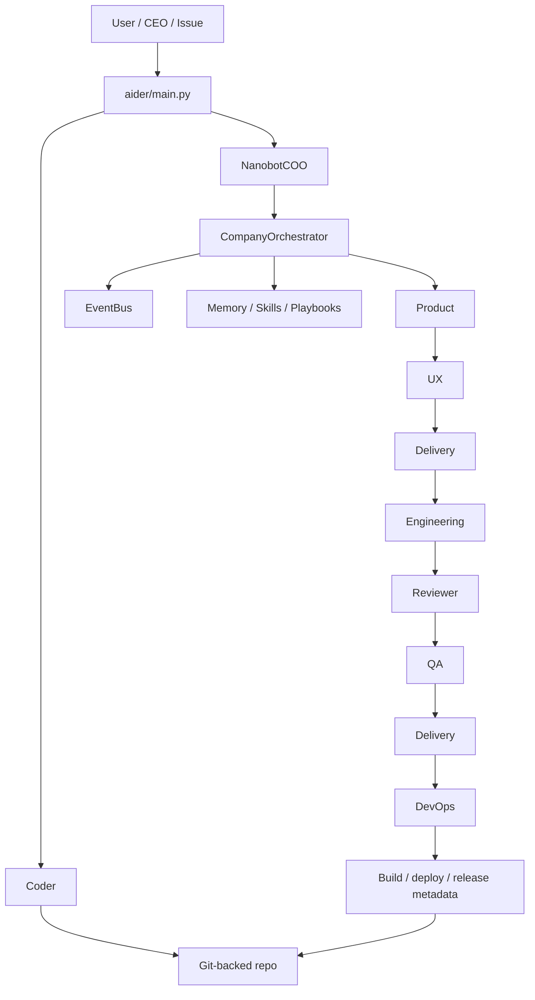

# First Code Tour

This tour follows the highest-signal path through Aider Plus: a user starts in
`aider/main.py`, asks for product work, and the request moves through the Coder,
COO, Company orchestrator, departments, shared memory/skills/events, the daemon,
templates/warehouse, and finally the DevOps release path.

Aider Plus deliberately keeps product work inside normal Git repositories. The
Company layer adds orchestration, role handoffs, local memory, approvals,
structured artifacts, and release discipline around the existing Aider coding
loop instead of replacing it.

## Main data flow

```text
User / issue / chat adapter / GUI
  |
  v
aider/main.py
  |-- classic flags ------------------------------+
  |                                                |
  v                                                v
Coder <------------------------------------ normal Git repo edits
  |
  | company commands, GUI actions, daemon work, or COO delegation
  v
NanobotCOO
  |  reads session history, project memory, warehouse memory, skills, daemon status
  |  decides: answer, clarify, remember, inspect, route, delegate, or escalate
  v
CompanyOrchestrator
  |  owns lifecycle, approvals, department routing, handoffs, audit, EventBus
  v
Product -> UX -> Delivery -> Engineering -> Reviewer -> QA -> Delivery -> DevOps
  |         |        |             |          |       |          |        |
  +---------+--------+-------------+----------+-------+----------+--------+
            |
            v
Skills + Memory + Playbooks + EventBus + Audit + Approval gates
            |
            v
Git-backed product repo + proof-of-work + release metadata
```

Optional Mermaid view:



## 1. Entry point: `aider/main.py`

Start at `main()` in `aider/main.py`. It is the traffic controller for startup:

- `aider warehouse ...` is parsed and handled before creating a Coder.
- `aider company ...` is parsed, may run a pre-Coder command such as
  `templates`, `daemon`, or `init`, and can prepare a Company workspace before
  normal Aider startup continues.
- `aider approve ...` and `aider reject ...` resolve persisted approval gates
  from the CLI so an orchestrator can recover decisions on a later run.
- If no first-run configuration exists, the CLI nudges the user toward
  `aider company init` but still supports classic Aider with `--skip-onboarding`.

If the command is not fully handled by a Company/Warehouse/onboarding shortcut,
startup continues into the standard Aider configuration and Coder creation path.
That is important: Company Mode is layered over the normal Aider loop rather than
being a separate runtime.

## 2. Coder: the repo-native editing loop

The `Coder` class in `aider/coders/base_coder.py` remains the center of direct
code editing. Company Mode eventually delegates implementation work back into
this style of repo-aware loop: files are read from the real checkout, model
messages produce diffs, tests can run in the developer environment, and changes
are reviewable as ordinary Git changes.

Use this mental model when reading Company code: Product, UX, Delivery, Reviewer,
QA, DevOps, COO, and daemon layers coordinate *what should happen* and *what is
safe to do next*; the Coder loop is still the low-level mechanism that modifies a
repository.

## 3. COO: `NanobotCOO` as the operations assistant

`NanobotCOO` in `aider/company/coo.py` is the CEO-facing operations layer. It can
answer directly, ask clarifying questions, remember context, inspect state,
inspect skills, summarize daemon status, route to departments, and escalate when
confidence is low or a gate needs a person.

The COO is intentionally not a replacement for the product-building pipeline. It
is a router and status assistant around that pipeline:

1. normalize the incoming message and session identity;
2. retrieve durable COO session history plus project/warehouse memory;
3. decide whether the request needs a direct answer, memory update, tool/status
   lookup, department delegation, or human escalation;
4. publish COO action/status/error events for surfaces; and
5. call the orchestrator when execution should enter Company workflow.

## 4. Orchestrator: the canonical Company runtime

`CompanyOrchestrator` in `aider/company/orchestrator.py` is the single place to
look for lifecycle coordination. GUI, CLI, chat adapters, daemon runs, and future
API/MCP surfaces should converge here instead of reimplementing department
routing.

The orchestrator owns these concerns:

- department registration and task submission;
- lifecycle and audit events;
- context retrieval from memory, skills, and playbooks;
- approval recovery and approval-required events;
- structured handoffs between Product, UX, Delivery, Engineering, Reviewer, QA,
  and DevOps;
- background task tracking and failure publication; and
- shared EventBus publication for live surfaces.

When adding a new surface, prefer sending a request to the COO/orchestrator and
rendering events from the shared bus. Thin chat/webhook surfaces should subclass
`aider.integrations.adapters.ThinAdapter`, normalize inbound payloads to
`AdapterMessage`, delegate user text with `handle_user_input()`, and subscribe to
EventBus updates with `subscribe_to_bus()` so shared `surface_messages.py`
renderers own status, approval, lifecycle, daemon, deployment, and COO text.
`aider.integrations.discord.DiscordAiderBot` and
`aider.integrations.slack.SlackAdapter` are the reference implementations. When
adding a new workflow rule, prefer putting it in the orchestrator or a department
instead of in a GUI or adapter.

## 5. Departments: role-specific loops and deliverables

Every department subclasses `Department` from `aider/company/department.py`.
Departments share a few key mechanics:

- each department has an inbox queue;
- each department implements `process(task)`;
- `run_loop()` consumes tasks, calls `process()`, emits audit events, and returns
  a `Deliverable`;
- departments can declare tool permissions and context requirements; and
- deliverables are structured enough for later departments, dashboards, daemon
  proof files, and audit views to consume.

The high-level product path is:

1. **Product** creates requirements, PRDs, launch criteria, and clarifying
   questions when the request is ambiguous.
2. **UX** converts requirements into flows, screens, states, accessibility notes,
   and schema-gated design specs.
3. **Delivery** tracks milestones, blockers, readiness, and release handoff
   quality.
4. **Engineering** plans and implements changes through Aider's code-editing
   loop.
5. **Reviewer** checks implementation quality and can feed bounded comments back
   into Engineering.
6. **QA** plans/runs validation and reports confidence, failures, and regression
   risks.
7. **Delivery** validates release readiness after QA.
8. **DevOps** executes the approved build/package/tag/deploy path and records
   release metadata.

## 6. Skills, memory, playbooks, audit, and EventBus

These shared services make the workflow durable and inspectable:

- **Memory** (`aider/memory/`) stores conversation summaries, project facts,
  retrieval context, consolidation output, and reusable patterns.
- **Skills** (`aider/company/skills.py`) retrieve role-scoped `SKILL.md`
  procedures, track usage, and support approval-gated skill proposals from
  successful patterns.
- **Playbooks** capture reusable lessons from previous runs and can be injected
  as context for departments.
- **Audit** records what happened, which department did it, and which payload was
  produced.
- **EventBus** (`aider/company/events.py`) is a typed in-process pub/sub stream
  with versioned events, severity, bounded replay, and surface-friendly payloads.

The pattern to preserve is: durable artifacts should be local, readable, and
structured; live status should flow through the shared EventBus; risky actions
should produce explicit approval gates.

## 7. Daemon: issue-driven Company work

The Company daemon in `aider/company/daemon/` turns tracker issues into bounded
Company runs. It can use a local JSON tracker or GitHub Issues, prepare an
isolated workspace per issue, run the built-in Company daemon runner, and write
proof-of-work artifacts.

Read the daemon path in this order:

1. `aider company daemon --workflow ...` is parsed in `aider/company/cli.py`.
2. Workflow configuration is loaded from `aider/company/workflow.py`.
3. `CompanyDaemon` lists candidate issues through a tracker adapter.
4. `RunWorkspaceManager` creates or reuses a Git-backed run workspace.
5. `CompanyDaemonRunner` executes configured departments and captures changed
   files, diffs, checks, feedback, handoffs, release status, and partial-success
   data.
6. `ProofOfWork` is written as JSON/Markdown and tracker state is updated for
   human review or completion.

The daemon is another surface over the same Company concepts: it should produce
proof and state, not hidden side effects.

## 8. Templates and warehouse

Templates in `aider/company/templates.py` define starter files, product metadata,
recommended skills, QA gates, post-creation guidance, and PRD seeds for common
MVP shapes. The warehouse manager in `aider/company/warehouse.py` keeps a registry
of normal product Git repositories under `products/<slug>/`.

The important flow is:

```text
aider company new IDEA --template TEMPLATE --warehouse PATH
  -> WarehouseManager.create_product()
  -> initialize/register products/<slug>/
  -> write starter files and .aider/company metadata
  -> create an initial scaffold commit
  -> run Company Mode inside that product repo
```

Treat the warehouse as discovery and organization, not as a custom VCS. Each
product remains a normal repo that classic Aider, Company Mode, CI, editors, and
humans can inspect directly.

## 9. DevOps release path

DevOps is the last stage, not a shortcut around QA or Delivery. Delivery remains
the readiness gate; DevOps executes only after a validated handoff.

`DevOpsDepartment` validates release schemas such as delivery handoffs, build
artifacts, deployment targets, and deployment results. It detects or accepts
allowlisted build/package/deploy commands, emits lifecycle events, records logs
and release metadata, and refuses risky deployment paths without explicit
approval signals.

A healthy release path looks like this:

```text
QA confidence + evidence
  -> Delivery readiness and handoff
  -> approval gate when required
  -> DevOps build/package/tag/deploy
  -> deployment result + rollback notes + audit/EventBus updates
```

## Key patterns to keep in mind

- **Structured dataclasses over loose dictionaries.** CLI commands, events,
  daemon run state, proof-of-work, deployment artifacts, and workflow config are
  modeled as dataclasses or schemas wherever possible.
- **Per-agent loops.** Departments have role-specific queues and `process()`
  implementations, but share common deliverable, audit, memory, and event
  behavior through the base department/orchestrator layer.
- **Approval gates.** Risky actions such as tool use, deployment, lifecycle
  transitions, skill proposals, and recovery decisions should be explicit,
  inspectable, and recoverable from persisted state.
- **Shared EventBus.** Surfaces should subscribe to the same typed event stream
  instead of inventing parallel status protocols. Late joiners use
  `get_recent_events()` or `replay_to_subscriber()` for retained activity, then
  render through `surface_messages.py` so lifecycle, daemon, deployment,
  approvals, Discord, Streamlit, Tkinter, and CLI `--watch` views share severity
  icons, compact/detailed modes, and progress visualizations.
- **Repo-native output.** The end product is a real Git repo with diffs, commits,
  tests, local artifacts, and reviewable release notes.
- **Thin adapters.** CLI, browser, desktop, Discord, daemon, MCP, and future API
  adapters should normalize input/output and delegate core behavior to the COO,
  orchestrator, departments, and daemon runner.

## Where to go next

- `README.md` for quickstart commands and glossary.
- `docs/company/nanobot_coo_architecture.md` for the COO mental model.
- `docs/company/zero_to_mvp.md` for template-backed product creation.
- `docs/company/symphony_daemon.md` for issue-driven daemon operation.
